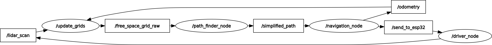

# SLAMBot ROS



## Overview

SLAMBot is a robotic system designed to navigate and map its environment using Simultaneous Localization and Mapping (SLAM) techniques. This project integrates various components, including a time-of-flight laser distance sensor, probabilistic occupancy grids, and advanced pathfinding algorithms, all managed within the Robot Operating System (ROS2).

## Table of Contents

- [Features](#features)
- [Installation](#installation)
- [Usage](#usage)
- [Directory Structure](#directory-structure)
- [Contributing](#contributing)
- [License](#license)

## Features

- **Real-time Mapping**: Utilizes probabilistic occupancy grids for accurate environmental mapping.
- **Pathfinding**: Implements the A* algorithm for efficient navigation.
- **Modular Design**: Easily replace or upgrade components with a plug-and-play approach.
- **ROS2 Integration**: Fully integrated with ROS2 for seamless communication and control.

## Installation

To set up the SLAMBot ROS project, follow these steps:

1. **Clone the Repository**:
   ```bash
   git clone https://github.com/NexusAurora/SLAMBot_Ros.git
   cd SLAMBot_Ros
   ```

2. **Install Dependencies**:
   Navigate to the `src/lidar_navigation` directory and install the required Python packages:
   ```bash
   cd src/lidar_navigation
   pip install -r requirements.txt
   ```

3. **Build the Package**:
   From the root of the workspace, build the package using:
   ```bash
   colcon build
   ```

4. **Source the Setup File**:
   After building, source the setup file:
   ```bash
   source install/setup.bash
   ```

## Usage

To run the SLAMBot, launch the ROS2 nodes as follows:

1. **Launch the Navigation Node**:
   ```bash
   ros2 run lidar_navigation navigation
   ```

2. **Launch the Pathfinding Node**:
   ```bash
   ros2 run lidar_navigation path_finder
   ```

3. **Visualize in RViz**:
   Open RViz to visualize the robot's mapping and navigation:
   ```bash
   rviz2 -d rviz_config.rviz
   ```

## Directory Structure

```
SLAMBot_Ros/
│   rosgraph.png
│   rviz_config.rviz
│   slam.code-workspace
│
└───src
    └───lidar_navigation
        │   package.xml
        │   setup.cfg
        │   setup.py
        │
        ├───lidar_navigation
        │   │   calibration_model.pth
        │   │   driver.py
        │   │   movement_weights.npy
        │   │   navigation.py
        │   │   path_finder.py
        │   │   requirements.txt
        │   │   settings.py
        │   │   update_grids.py
        │   │   __init__.py
        │   │
        │   ├───utilities
        │   │   │   model.py
        │   │   │   movement.py
        │   │   │   openCV_display.py
        │   │   │   particle_filter.py
        │   │   │   particle_filter_manual.py
        │   │   │   path_finding.py
        │   │   │   plotter.py
        │   │   │
        │   │   └───__pycache__
        │   │           model.cpython-310.pyc
        │   │           movement.cpython-310.pyc
        │   │           particle_filter.cpython-310.pyc
        │   │           path_finding.cpython-310.pyc
        │   │           plotter.cpython-310.pyc
        │   │
        │   └───__pycache__
        │           settings.cpython-310.pyc
        │
        ├───resource
        │       lidar_navigation
        │
        └───test
                test_copyright.py
                test_flake8.py
                test_pep257.py
```

## Contributing

Contributions are welcome! If you have suggestions for improvements or new features, please fork the repository and submit a pull request.

## License

This project is licensed under the MIT License. See the [LICENSE](LICENSE) file for details.
